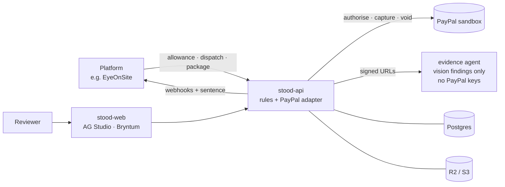

<p align="center">
  
</p>

<h3 align="center">Money does not move until someone stood there.</h3>

<p align="center">
  An open-source <b>release gate for staged payments</b>, built on PayPal and AI.<br>
  <em>A payer signs what "done" means. Evidence is checked. The money moves, or it doesn't, and you're told why.</em>
</p>

<p align="center">
  <a href="https://ma-za-kpe.github.io/stood/"><b>Website</b></a> ·
  <a href="docs/USAGE.md"><b>Usage manual</b></a> ·
  <a href="https://ma-za-kpe.github.io/stood/changelog.html"><b>Changelog</b></a> ·
  <a href="docs/README.md"><b>Docs</b></a> ·
  <a href="TASKS.md"><b>Roadmap</b></a>
</p>

<p align="center">
  <a href="https://github.com/ma-za-kpe/stood/actions/workflows/ci.yml"></a>
  <a href="https://github.com/ma-za-kpe/stood/actions/workflows/pages.yml"></a>
  <a href="https://github.com/ma-za-kpe/stood/releases"></a>
  <a href="LICENSE"></a>
  
  
  
  <a href="https://paypalaihackathon.devpost.com/"></a>
</p>

---

> ⚠️ **Status: early implementation.** Docker tooling, the tested pure domain and a local synthetic-fixture API are implemented. Payments, SDKs, hosted replay and product screens remain planned. PayPal integration is **sandbox only**: no real money, no real personal data. See the [roadmap](#roadmap).

## The problem

Ama is a nurse in London, paying in stages for a house on a plot in Accra. The WhatsApp photos stop in month four. Fourteen months later the house is half-built and the money is gone, with no record of what was paid against what.

When the same corridor goes through the "official" pipes, the money is **held for weeks with no reason given**. Both are the same failure: **money moves without a reason attached.** Diaspora remittances to Africa are about $95–100B a year. The rails that move money exist. Nothing checks what the money bought once it lands.

## What Stood does

Stood is the **gate** a platform calls before a staged payment leaves.

1. **Allowance:** the payer signs once, in PayPal, what "done" means for each milestone.
2. **Hold:** when a milestone is ready, PayPal **authorises** the amount. It's held, not paid.
3. **Evidence:** the platform sends a package: photos, files, recordings, coordinates, and a one-time code.
4. **Decision:** deterministic rules decide, and AI only reports what it sees:

<p align="center">
  
  &nbsp;
  
  &nbsp;
  
</p>

| Outcome | What happens to the money | What the payer reads |
|---|---|---|
| **Released** | PayPal **captures** the tranche | "Foundation released. £4,000 paid. Kojo stood on the plot at 10:42." |
| **Refused** | PayPal **voids** the hold. Nothing leaves | "Wrong plot. 1.4 km off. Nothing was paid." |
| **In review** | Still held. A person checks | "A person is checking these photos. £4,000 is still held, not paid." |

Every decision is written onto the PayPal order and leaves a **file** (receipt + dispute packet): who allowed it, what was captured, what the evidence showed.

### Principles

- **Rules move money; models only report.** The AI that looks at evidence runs **without PayPal credentials** ([ADR-0003](docs/adr/0003-rules-move-money.md)).
- **Fail closed.** Missing or uncertain evidence means **wait**. An expired hold pays nothing.
- **Never holds funds.** PayPal holds the authorisation. The calling platform pays people on local rails ([ADR-0004](docs/adr/0004-authorise-on-dispatch-capture-on-proof.md)).
- **Industry-blind.** Stood knows allowances, evidence and decisions, never houses or code. Verticals are **evidence profiles** ([ADR-0007](docs/adr/0007-domain-agnostic-evidence-profiles.md)).
- **Never silent.** Every state has one plain sentence.

## Use cases

One endpoint, many checklists ([S16](docs/stood/S16-use-cases-and-evidence-profiles.md)):

| Domain | "Done" means | Profile |
|---|---|---|
| Diaspora construction ([EyeOnSite](https://github.com/ma-za-kpe/eyeonsite), the first caller) | The stage is reached on this plot | `construction.stage@1` |
| Freelance milestones | These screens and links were delivered, and they're not last week's files | `freelance.milestone@1` |
| Insurance claims and lending draws | The field visit shows the damage, the stock or the shop | `claims.field_visit@1` |
| Rentals and deposits | Return photos match checkout (inverted: a match returns the deposit) | `rental.return@1` |
| Grants and NGOs | The site matches the proposal milestone | `grant.site_visit@1` |
| Trade and goods | The seal, container and batch were received | `delivery.goods@1` |
| AI agents that pay | The task's acceptance checks pass (via the Stood MCP) | any |

## Quickstart

**Judges and evaluators:** the 2-minute path (demo scenarios against the PayPal sandbox, no account needed) is at the top of the **[usage manual](docs/USAGE.md#for-hackathon-judges-try-it-in-2-minutes)**.

**Integrators** (planned `@stood/sdk`, v1 draft contract):

```ts
import { Stood } from '@stood/sdk';

const stood = new Stood({ baseUrl: process.env.STOOD_BASE_URL, apiKey: process.env.STOOD_API_KEY,
                          hmacSecret: process.env.STOOD_HMAC_SECRET });

const allowance = await stood.allowances.create({ /* milestones + evidence profiles */ });
// → send the payer to allowance.approve_url (PayPal), then:
const held = await stood.tranches.dispatch(trancheId);         // PayPal hold + nonce
await stood.tranches.submitPackage(held.id, { /* evidence */ }); // → webhook: released | refused | waiting
```

Keys you need: `STOOD_API_KEY`, `STOOD_HMAC_SECRET` and `STOOD_WEBHOOK_SECRET` (server-side only). Self-hosting adds **sandbox** PayPal credentials, Postgres, S3 / R2 and the evidence agent. See [Keys and configuration](docs/USAGE.md#keys-and-configuration).

## Architecture



Hexagonal domain core, pure decision rules, idempotent money commands, a transactional outbox. Details: [T02 Architecture](docs/tech/T02-architecture.md) · [T03 Domain](docs/tech/T03-domain-model.md) · [T04 API](docs/tech/T04-api-spec.md) · [T06 PayPal](docs/tech/T06-paypal-integration.md).

## Built with

**PayPal** at the centre (Orders v2 authorise / capture / void, Vault, Disputes, Transaction Search, Agent Toolkit MCP, the APIMatic-generated Server SDK), plus each hackathon partner given **one honest job** ([S13](docs/stood/S13-sponsor-integration.md)):

| Partner | Job in Stood |
|---|---|
| APIMatic | Context Plugin grounds PayPal SDK calls. Generates Stood's SDK, docs and MCP |
| AG Grid · AG Studio | Reviewer file + reconciliation (gate-bypass detector) |
| Bryntum | Gantt of milestones, each locked until released |
| Channel3 | Catalog match: was the specified fitting installed? |
| Render | Hosting (Docker) + durable hold timers (Workflows) |
| Astropods | Runs the evidence agent, with no PayPal credentials |
| Elastic | Evidence memory: reused and internet photo detection |
| Kernel | Automates the sandbox buyer approval so judges can replay every outcome |
| Postman | Public workspace, fixtures, uptime monitors |
| Zapier | Delivers the one-line reason by email / SMS / Slack |

**Runs on free tiers:** Render · Neon Postgres · Cloudflare R2 · Cloudflare Workers AI (Llama 3.2 Vision, open weights) · GitHub Actions / Pages. Everything else is open source ([T09](docs/tech/T09-tech-stack.md), [T10](docs/tech/T10-deployment.md)).

## Repository map

```text
.
├─ site/                 Landing page + changelog (GitHub Pages, deploys on merge to main)
├─ tools/site/           Site build (version + rendered CHANGELOG.md)
├─ docs/
│  ├─ USAGE.md           Usage manual: keys, quickstart, webhooks, profiles
│  ├─ WAYS_OF_WORKING.md TDD · DDD · OOP · GitFlow · pre-commit · Definition of Done
│  ├─ stood/             Product specs S01–S16
│  ├─ tech/              Technical docs T01–T15
│  ├─ adr/               Architecture decisions 0001–0007
│  ├─ brand/             Logo, app icons, social, verdict chips (Volt)
│  └─ 01–13 *.md         Research, hackathon, PayPal landscape, judges, checklist
├─ TASKS.md              Append-only task ledger + ground rules + full backlog
├─ .pre-commit-config.yaml  The cutthroat gate (also run by CI)
└─ .github/              CI, Pages, release-please, back-merge, templates, rulesets
```

Planned product code (from 0.2.0): `apps/web`, `services/api`, `services/workflows`, `services/evidence-agent`, `openapi/`, `fixtures/` ([S14](docs/stood/S14-open-source-plan.md)).

## Documentation

| Area | Docs |
|---|---|
| **Use it** | [Usage manual](docs/USAGE.md) |
| **Product** | [Overview](docs/09-stood.md) · [S01 Problem](docs/stood/S01-problem-statement.md) · [S02 Boundary](docs/stood/S02-product-boundary.md) · [S03 Personas](docs/stood/S03-personas.md) · [S04 Outcomes](docs/stood/S04-job-story-and-outcomes.md) · [S05 Features](docs/stood/S05-feature-list.md) · [S06 Voice](docs/stood/S06-voice-and-states.md) · [S08 Screens](docs/stood/S08-screens.md) · [S11 Evidence integrity](docs/stood/S11-evidence-integrity.md) · [S16 Use cases](docs/stood/S16-use-cases-and-evidence-profiles.md) |
| **Technical** | [T01 Requirements](docs/tech/T01-requirements.md) · [T02 Architecture](docs/tech/T02-architecture.md) · [T03 Domain](docs/tech/T03-domain-model.md) · [T04 API](docs/tech/T04-api-spec.md) · [T05 Data](docs/tech/T05-data-model.md) · [T06 PayPal](docs/tech/T06-paypal-integration.md) · [T07 Evidence](docs/tech/T07-evidence-pipeline.md) · [T08 EyeOnSite](docs/tech/T08-eyeonsite-integration.md) · [T09 Stack](docs/tech/T09-tech-stack.md) · [T10 Deployment](docs/tech/T10-deployment.md) · [T11 Security](docs/tech/T11-security-privacy.md) · [T12 Testing](docs/tech/T12-testing-and-quality.md) · [T13 Runbooks](docs/tech/T13-observability-and-runbooks.md) · [T14 Milestones](docs/tech/T14-feature-breakdown-and-milestones.md) · [T15 Docker](docs/tech/T15-docker-and-local-dev.md) |
| **Design** | [S15 Design system "Volt"](docs/stood/S15-design-system.md) · [Brand assets](docs/brand/) |
| **Hackathon** | [Rules and prizes](docs/06-paypal-hackathon.md) · [Partner map](docs/stood/S13-sponsor-integration.md) · [Plan](docs/stood/S12-hackathon-plan.md) · [Demo script](docs/stood/S09-demo-script.md) · [Submission checklist](docs/13-submission-checklist.md) |
| **Decisions** | [ADR 0001–0007](docs/adr/) · [Audit log](docs/audit-log.md) · [Sources](docs/sources.md) |
| **Research** | [Docs index](docs/README.md) (agent economy, pyramid schemes, PayPal landscape, Africa payments) |

## Development

**Docker only.** The host needs git, Docker and **pre-commit** ([T15](docs/tech/T15-docker-and-local-dev.md)).

### 1. Install pre-commit (mandatory, before your first commit)

```bash
pip install pre-commit             # or: brew install pre-commit / pipx install pre-commit
pre-commit install                 # installs BOTH hooks: pre-commit + commit-msg
pre-commit run --all-files         # must pass before you push
```

Check it's active: `ls .git/hooks/pre-commit .git/hooks/commit-msg` should list both files. The `commit-msg` hook rejects any commit without a Conventional message and a **DCO sign-off**, so always commit with `git commit -s`.

**There's no way around the gate:**

- CI runs the **same** `.pre-commit-config.yaml` on every PR (`pre-commit` check).
- Rulesets on `develop` and `main` block merging until the `pre-commit`, `pr-title` and `dco` checks pass.
- `--no-verify` doesn't help, because CI fails the PR anyway.

What the gate checks ([WoW §8](docs/WAYS_OF_WORKING.md#8-validation-before-commit-pre-commit-is-cutthroat)):

- repository hygiene
- secrets (gitleaks)
- GitHub Actions (actionlint, zizmor, schemas)
- docs (markdownlint, typos, offline links and anchors)
- web code (Biome)
- banned words in user-facing copy
- GitFlow branch names, Conventional Commits and DCO

### 2. Run everything in Docker

```bash
git clone https://github.com/ma-za-kpe/stood && cd stood
docker compose build app
./scripts/dev install
docker compose up -d db s3 mail        # Postgres, local S3, Mailpit
docker compose run --rm app pnpm test  # every command runs in a container
docker compose up -d api              # synthetic fixtures, no payment execution
```

### 3. Branch, commit and open a PR (GitFlow)

```bash
git switch develop && git pull
git switch -c feature/42-hold-timers   # <type>/<issue>-<slug>, validated by the gate
# … write the failing test first, then the code …
git commit -s -m "feat(tranche): reauthorise holds from day 4"
git push -u origin feature/42-hold-timers   # open a PR into develop
```

- `feature/*` → `develop` (squash, Conventional-Commit PR title) → `main` (merge commit) → release-please tags `vX.Y.Z` and updates the [changelog](https://ma-za-kpe.github.io/stood/changelog.html). `develop` is the default branch ([ADR-0006](docs/adr/0006-open-source-branching-strategy.md)).
- **Test-first, domain-driven:** red → green → refactor. 100% branch coverage on decision and money code ([WoW §4–6](docs/WAYS_OF_WORKING.md#4-test-driven-development)).
- **Reviews:** engineers implement. Every PR gets a code review and a product review against the specs and the Definition of Done.

## Roadmap

| Version | Target | Scope |
|---|---|---|
| 0.1.0 | Oct 2026 | Docs, brand, landing page, quality gate (this release) |
| 0.2.0 | 16 Oct | Refuse path end to end in sandbox: allowance, hold, rules, void, deployed |
| 0.3.0 | 23 Oct | All three outcomes, evidence agent, receipts, webhooks, EyeOnSite wired |
| 0.4.0 | 30 Oct | Reviewer file (AG Studio), Gantt, dispute packet, notifications |
| 1.0.0 | 11 Nov | Hackathon submission: video, partner docs, final checklist |

The full backlog lives in [TASKS.md](TASKS.md). Milestone detail is in [T14](docs/tech/T14-feature-breakdown-and-milestones.md).

## Contributing

Contributions are welcome. Read [CONTRIBUTING](CONTRIBUTING.md) and [Ways of working](docs/WAYS_OF_WORKING.md), **install pre-commit**, then pick an issue.

We especially want to hear from:

- people who've sent money home for a build,
- inspectors, surveyors and builders in Ghana, Nigeria, Kenya or Uganda,
- freelancers and platforms with milestone payments,
- payments, risk and compliance folks.

- **Code of conduct:** [Contributor Covenant 2.1](CODE_OF_CONDUCT.md)
- **Security:** report privately, see [SECURITY.md](SECURITY.md). Never test with real accounts or real money.

## License

[MIT](LICENSE) © 2026 ma-za-kpe and Stood contributors.

Third-party tools and services (PayPal, AG Grid / AG Studio, Bryntum and the other partners) are subject to their own licences and terms. Commercial components are installed from their registries and never vendored. "Stood" hasn't yet been checked as a trademark.
