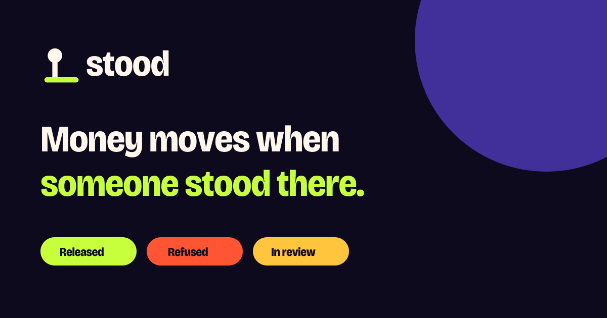
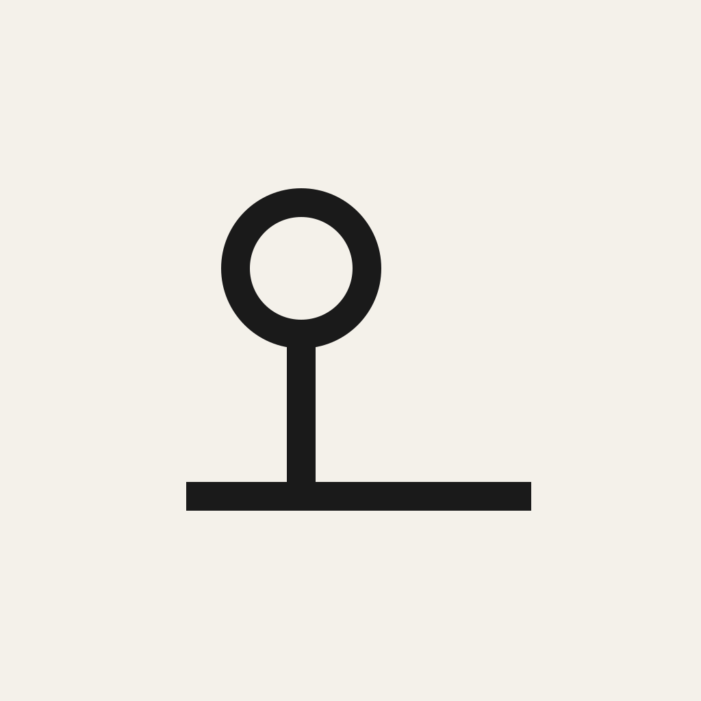

  

<a href="https://ma-za-kpe.github.io/stood/"><b>→ ma-za-kpe.github.io/stood</b></a>

<h3 align="center">Money does not move until someone stood there.</h3>

  An open-source release gate for staged payments, built on PayPal and AI. 
  <em>A payer abroad signs what "done" means. An inspector's evidence is checked. The money moves, or it doesn't, and you're told why.</em>

  
  
  

---

## The problem

Ama is a nurse in London, paying in stages for a house on a plot in Accra. The WhatsApp photos stop in month four. Fourteen months later the house is half-built and the money is gone, with no record of what was paid against what.

When the same corridor goes through the "official" pipes, the money is **held for weeks with no reason given**. Both are the same failure: **money moves without a reason attached.** Diaspora remittances to Africa are about $95–100B a year. The rails that move money exist. Nothing checks what the money bought once it lands.

## What Stood does

Stood is the **gate** a platform calls before a staged payment leaves.

1. **Allowance:** the payer signs once what "done" means: this plot, these photos, this amount.
2. **Hold:** when a stage is ready, PayPal **authorises** the tranche. It's held, not paid.
3. **Evidence:** an inspector captures photos on site, including a one-time code written on paper.
4. **Decision:** rules decide, and the AI reports what it found:

  
  &nbsp;
  
  &nbsp;
  

| Outcome | What happens to the money | What the payer reads |
|---|---|---|
| **Released** | PayPal **captures** the tranche | "Foundation released. £4,000 paid. Kojo stood on the plot at 10:42." |
| **Refused** | PayPal **voids** the hold. Nothing leaves | "Wrong plot. 1.4 km off. Nothing was paid." |
| **In review** | Still held. A person checks | "A person is checking these photos. £4,000 is still held, not paid." |

Every decision writes onto the PayPal order and leaves a **file**: who allowed it, what was captured, what stood on the plot. A dispute becomes evidence, not an argument.

### Principles

- **Rules move money; models only report findings.** The AI that looks at photos runs without PayPal credentials.
- **Stood never holds funds** and never pays anyone locally. Platforms (like [EyeOnSite](https://github.com/ma-za-kpe/eyeonsite)) own users, matching and local payouts.
- **No silent holds.** Every state has one plain sentence.

## Status

📐 **Design and research phase. No code yet.** Built in the open for the [PayPal AI Hackathon](https://paypalaihackathon.devpost.com/) (submissions close 12 Nov 2026).

Everything decided so far is in **[`docs/`](docs/README.md)**: research, product specs, demo script, sponsor integration plan, judging checklist, and the design system. Every claim is source-checked in the [audit log](docs/audit-log.md).

| Start here | |
|---|---|
| **[Usage manual](docs/USAGE.md)** | Install, keys, quickstart, webhooks, profiles, self-hosting. **Judges: start here** |
| [Stood overview](docs/09-stood.md) | Vision, money model, where the AI is |
| [Product docs S01–S15](docs/README.md#stood-product-docs-stood) | Problem, boundary, personas, outcomes, features, voice, screens, demo, evidence integrity |
| [Partner integration map](docs/stood/S13-sponsor-integration.md) | How every hackathon partner tool is used, and what we refused to use it for |
| [Open-source plan](docs/stood/S14-open-source-plan.md) | Repo layout, MCP setup, "how we used every tool" lessons |
| [Design system](docs/stood/S15-design-system.md) | Themes, tokens, type, logo, platform assets |
| [Technical docs T01–T14](docs/tech/README.md) | Requirements, architecture, API, data, PayPal, evidence pipeline, deployment on free tiers |
| [EyeOnSite integration](docs/tech/T08-eyeonsite-integration.md) | Where [EyeOnSite](https://github.com/ma-za-kpe/eyeonsite) calls Stood and how its payments change |

## Built with (planned)

**PayPal** (Orders v2: authorise / capture / void, Vault, Disputes, Transaction Search, Agent Toolkit MCP, Server SDK), plus each hackathon partner given one honest job:

| Partner | Job in Stood |
|---|---|
| APIMatic | Context Plugin grounds PayPal SDK calls. Generates Stood's own SDK / MCP |
| AG Grid · AG Studio | The reviewer file and reconciliation (gate-bypass detector) |
| Bryntum | Gantt of tranches, each locked until released |
| Channel3 | Fixtures spec check: did the builder install what was paid for? |
| Render | Hosting and durable hold timers (Workflows) |
| Astropods | Runs the evidence agent, with no PayPal credentials |
| Elastic | Evidence memory: reused and internet photo detection |
| Kernel | Automates sandbox buyer approval so judges can replay every outcome |
| Postman | Public workspace, fixtures, uptime monitors |
| Zapier | Delivers the one-line reason by email / SMS / WhatsApp |

**Runs on (free tiers):** Render (API, static web, Workflows) · Neon Postgres · Cloudflare R2 · Cloudflare Workers AI (Llama 3.2 Vision, open weights) · GitHub Actions. Everything else is open source. See [T09](docs/tech/T09-tech-stack.md) / [T10](docs/tech/T10-deployment.md).

## Brand

  
  &nbsp;&nbsp;
  
  &nbsp;&nbsp;
  

**Volt**: deep night, electric violet, and three verdict colours (volt / flare / sun) that hit like stage lights. The mark is a pin standing on a ground line. Assets are in [`docs/brand/`](docs/brand/). The system is in [S15](docs/stood/S15-design-system.md). The landing page in [`site/`](site/) is deployed to GitHub Pages on every merge to `main`.

## Contributing

How we work: **[Ways of working](docs/WAYS_OF_WORKING.md)** (test-first, domain-driven, trunk-based with release-please, pre-commit gates) · [ADRs](docs/adr/) · [Task ledger](TASKS.md) · [CONTRIBUTING](CONTRIBUTING.md).

The project is in its design phase. Issues and discussion on the docs are welcome, especially from:

- people who've sent money home for a build,
- inspectors, surveyors and builders in Ghana, Nigeria, Kenya or Uganda,
- payments and risk folks.

## License

[MIT](LICENSE). Third-party tools and services referenced here (PayPal, AG Grid, Bryntum, and others) are subject to their own licences and terms. "Stood" hasn't yet been checked as a trademark.
