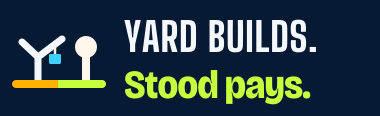
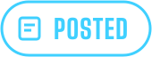
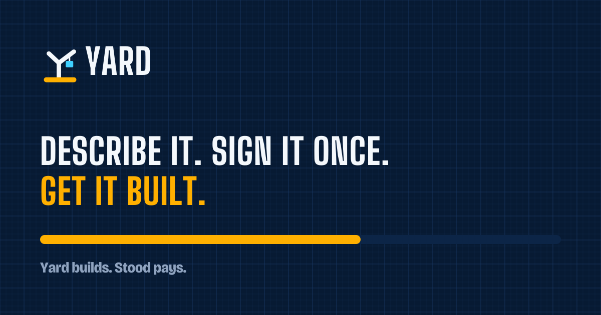

# Yard brand kit, "Hi-vis Blueprint"

Rules, tokens and components: [Y17 design system](../../yard/Y17-design-system.md). Direction and voice: [Y09](../../yard/Y09-brand-and-design-system.md). Every wordmark and chip label is **outlined** Big Shoulders Display 800 (OFL), so these SVGs render with no font installed.

## Logo

| On paper | On navy |
|---|---|
|  |  |
|  |  |
|  |  |

Mono: [`yard-mark-mono.svg`](logo/yard-mark-mono.svg). Favicon (follows the colour scheme): [`favicon.svg`](logo/favicon.svg).

## Family lockup

Crane and pin stand on **one shared ground line**: hi-vis under Yard, volt under Stood.

## Status chips

     

"Paid", "Refused" and "In review" are **Stood's** verdicts and use Stood's own stamps in [`docs/brand/logo/`](../logo/), never a Yard chip.

## App icons

| File | Use |
|---|---|
| [`yard-app-icon-1024.svg`](app-icons/yard-app-icon-1024.svg) | iOS / store icon |
| [`yard-app-icon-tinted-1024.svg`](app-icons/yard-app-icon-tinted-1024.svg) | iOS tinted mode |
| [`yard-android-foreground-432.svg`](app-icons/yard-android-foreground-432.svg) + [`background`](app-icons/yard-android-background-432.svg) | Android adaptive icon |
| [`yard-maskable-512.svg`](app-icons/yard-maskable-512.svg) | PWA maskable icon |

## Social

Avatar: [`yard-avatar-400.svg`](social/yard-avatar-400.svg).

## Patterns

| Pattern | Use |
|---|---|
| [`blueprint-grid.svg`](patterns/blueprint-grid.svg) | 96px tile behind the hero and the Board |
| [`hazard-tape.svg`](patterns/hazard-tape.svg) | 32px tile, **only** for in-progress bars and active leases |
