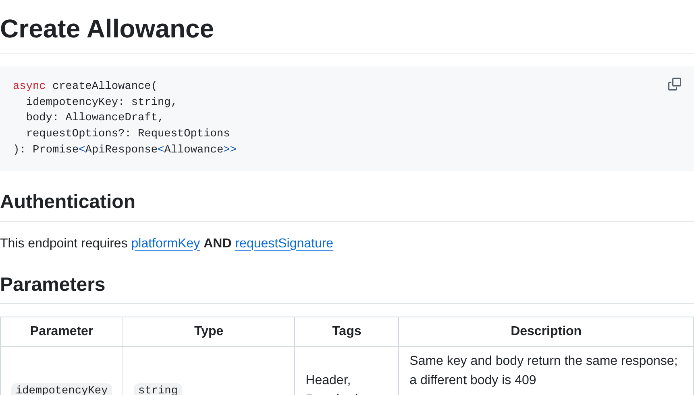
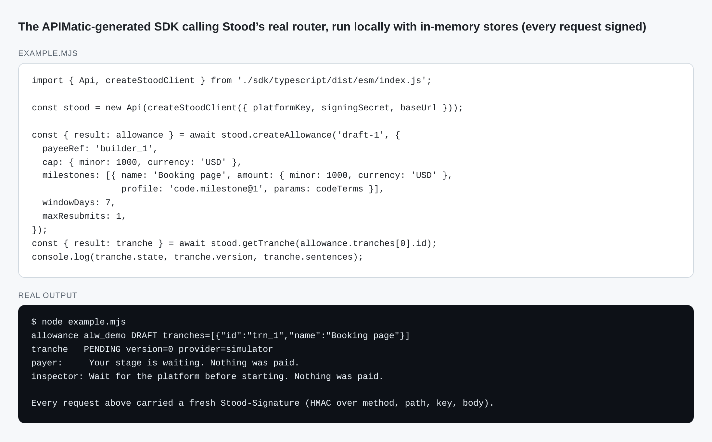
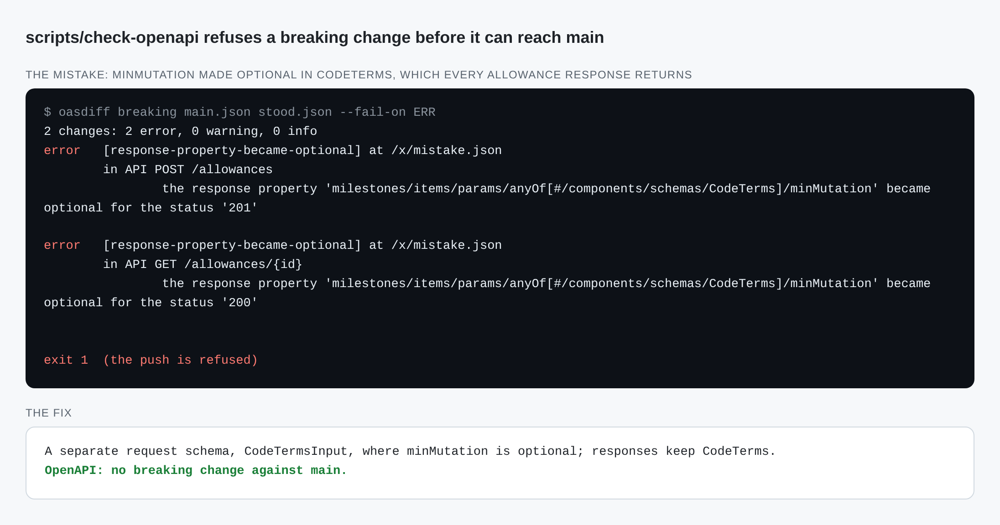

# APIMatic: a typed SDK from your OpenAPI contract, step by step

A practical guide for developers who want a **generated client SDK that stays true to their API**, even when the API uses something an OpenAPI security scheme cannot describe, such as a per-request HMAC signature. It uses [APIMatic](https://www.apimatic.io) to generate a TypeScript SDK from an OpenAPI 3.1 document. It is written from Stood's own runs on 10 October 2026, including every mistake we made and how we fixed it.

Stood's code is linked at each step, so you can read a working, tested implementation:

- [`services/api/src/http/contract.ts`](../../services/api/src/http/contract.ts): the API contract as Zod schemas, and the generator of the OpenAPI document
- [`openapi/stood.json`](../../openapi/stood.json): the generated OpenAPI 3.1 document, APIMatic's input
- [`apimatic/`](../../apimatic): the APIMatic project (settings, and the saved customizations)
- [`sdk/typescript/`](../../sdk/typescript): the generated SDK, with its own [README](../../sdk/typescript/README.md) and reference docs
- [`sdk/typescript/src/stoodClient.ts`](../../sdk/typescript/src/stoodClient.ts): the one hand-written file, the request signer
- [`services/api/test/sdk/apimatic-sdk.sdk.test.ts`](../../services/api/test/sdk/apimatic-sdk.sdk.test.ts): the SDK calling the real Stood router over HTTP

## 1. The problem APIMatic solves

Stood is an API: platforms such as Yard call it to draft allowances, fund milestones and submit work for checking. Every platform that integrates has to write the same client code: request and response types, error handling, retries, timeouts, and Stood's request signing. Each hand-written client drifts from the server a little, and the drift shows up as a failed payment flow.

APIMatic reads the OpenAPI document and generates that client: typed models for every request and response, one method per operation, typed errors for each documented problem, retries, timeouts and reference documentation. When the API changes, regenerating the SDK changes the client in the same commit.

## 2. APIMatic's role in the whole platform

```text
   services/api/src/http/contract.ts  (Zod schemas, the source of truth)
                 │  scripts/dev openapi
                 ▼
          openapi/stood.json  ──── Redocly lint, oasdiff breaking-change check (scripts/check-openapi)
                 │  scripts/dev sdk  (APIMatic CLI)
                 ▼
          sdk/typescript  + saved customization: createStoodClient (signs each request)
                 │  scripts/check-sdk
                 ▼
          real Stood router over HTTP: all nine operations, typed errors, wrong secret refused
```

| APIMatic does | APIMatic never does |
| --- | --- |
| Generates the TypeScript SDK and its reference docs from `openapi/stood.json` | Define the API: the Zod contract does, and contract tests hold the real router to it |
| Keeps our one hand-written file (the signer) and the SDK's lockfile across regenerations | See any Stood secret: it receives only the public OpenAPI document |
| Runs only when a developer regenerates the SDK | Run in Stood's production path, in CI, or at request time |

## 3. Use cases

1. **Integrate a platform with Stood in minutes.** `createStoodClient({ platformKey, signingSecret })`, then call `createAllowance`, `getTranche`, `submitPackage` and the rest with typed inputs and outputs.
2. **Keep clients honest.** The contract test fails if the router and the document disagree; the SDK test fails if the generated client cannot talk to the router.
3. **Document the API for people.** The generated `doc/` folder has a page per operation and per model, with examples.
4. **Hackathon requirement.** APIMatic is a PayPal AI Hackathon sponsor; this SDK is our use of it, alongside the PayPal context plugin recorded in [T16](../tech/T16-paypal-ai-toolkit.md).

## 4. Results from our runs (10 October 2026)

| Step | Result |
| --- | --- |
| Generate the TypeScript SDK (`scripts/dev sdk`) | Succeeded: 24 typed models plus one union container, 9 operations, reference docs |
| Signer saved as a customization (`scripts/dev sdk-save`) | `stoodClient.ts` added, `index.ts` export, `package-lock.json`: reapplied on every generation |
| Regenerate from an unchanged spec | Byte-identical SDK |
| SDK against the real router (`scripts/check-sdk`) | 2 of 2 tests pass: all nine operations signed and parsed; a missing tranche is a typed `ProblemError`; a wrong secret is a 401 |

## 5. Setup

### 5.1 APIMatic account and API key

1. Sign up at [app.apimatic.io](https://app.apimatic.io) (a free trial is enough for SDK generation).
2. Open **Account → API Keys** and create a key. Name it for its job, for example `stood-sdk`.
3. Copy the key; treat it like a password.

### 5.2 `.env`

Add to the gitignored `.env` (mode 600):

```bash
APIMATIC_API_KEY=...
```

Only the person regenerating the SDK needs it. CI builds and tests the committed SDK without any APIMatic key.

### 5.3 The APIMatic project

APIMatic works on a project folder that contains `src/spec/`. Ours is [`apimatic/`](../../apimatic):

```text
apimatic/
  src/spec/APIMATIC-META.json      settings (BrandLabel "Stood", DisableLinting)
  src/spec/stood.json              copied from openapi/stood.json at each run (gitignored)
  src/sdk-source-tree/.typescript  APIMatic's record of our customizations (managed by the CLI; never edit)
```

## 6. Run it

```bash
scripts/dev openapi    # regenerate openapi/stood.json from the Zod contract
scripts/dev sdk        # regenerate sdk/typescript with APIMatic, reapplying saved customizations
scripts/check-openapi  # lint, and fail on breaking changes against main
scripts/check-sdk      # build the SDK and call the real router over HTTP
```

`scripts/dev sdk` runs the pinned CLI (`npx -y @apimatic/cli@1.5.0`) in the dev container and passes only `APIMATIC_API_KEY`, through a private temporary file it deletes afterwards.

Using the SDK:

```ts
import { Api, createStoodClient } from './sdk/typescript/dist/esm/index.js';

const stood = new Api(createStoodClient({ platformKey: process.env.STOOD_API_KEY!, signingSecret: process.env.STOOD_HMAC_SECRET! }));
const { result: allowance } = await stood.createAllowance('draft-2026-10-10-1', {
  payeeRef: 'builder_1',
  cap: { minor: 1000, currency: 'USD' },
  milestones: [{ name: 'build', amount: { minor: 1000, currency: 'USD' }, profile: 'code.milestone@1', params: codeTerms }],
  windowDays: 7,
  maxResubmits: 1,
});
const { result: tranche } = await stood.getTranche(allowance.tranches[0].id);
```

The first argument of every POST is the idempotency key: the same key and body return the same response.

## 7. What a run looks like, step by step

**Generate** (`scripts/dev sdk`, output cleaned of spinner frames):

```text
┌   Generate SDK
●  Successfully applied saved changes for 'typescript' SDK.
●  The generated SDK can be found at '/workspace/sdk/typescript'
│    and the 'sdk-source-tree' can be found at '/workspace/apimatic/src/sdk-source-tree/.typescript'.
└  Succeeded
```

**Save a customization** (`scripts/dev sdk-save`, interactive; answer the review question):

```text
│        ├─ index.ts # Modified
│        └─ stoodClient.ts # Added
◆  Do you want to review these changes?
│  ○ Yes / ● No
◆  Changes saved successfully at '.../apimatic/src/sdk-source-tree/.typescript'.
●  Your saved changes will reapply automatically the next time you generate this SDK.
```

**Check against the real router** (`scripts/check-sdk`):

```text
 ✓ services/api/test/sdk/apimatic-sdk.sdk.test.ts (2 tests)
      Tests  2 passed (2)
```

### What you get, in pictures

These are real: a page of the generated reference as GitHub renders it, the generated SDK running against Stood's own router (run locally with in-memory stores, so no money moves), and the breaking-change check refusing a mistake we actually made on 10 October 2026.

**1. The generated reference.** One page per operation, with its signature, the authentication it needs and every parameter. Nobody wrote this page; APIMatic generated it from `openapi/stood.json` ([live on GitHub](../../sdk/typescript/doc/controllers/api.md)).



**2. The SDK in use.** Typed inputs (`payeeRef`, `windowDays`) and typed results (`tranche.state`, `tranche.sentences`). The signer we added makes every request carry a fresh `Stood-Signature`.



**3. A mistake caught before it shipped.** Making a field optional looked harmless, but every allowance response returns it, so clients relying on it would break. `scripts/check-openapi` (oasdiff) refused the push; the fix was a separate request schema.



## 8. How it works

1. **Contract first.** Zod schemas in `contract.ts` describe each request and response; each schema with a `meta({ id })` becomes a named component. `openApiDocument()` builds the OpenAPI 3.1 document deterministically, and a test fails if the committed file differs.
2. **Held to the server.** Contract tests run the real router: the set of routes equals the documented operations, every response parses against its schema, and invalid bodies are refused by both the schema and the server.
3. **Generated.** APIMatic turns each operation into a method on `Api` and each component into a model with runtime validation, so a response that breaks the contract fails loudly in the client too.
4. **Signed.** Stood's `Stood-Signature` is an HMAC over the method, path, idempotency key, `If-Match`, content type and body, so it cannot be a fixed header. `createStoodClient` gives the generated client an HTTP adapter that computes the signature for each request just before sending it (with `fetch`) and returns the raw body for the SDK to parse.
5. **Kept.** The signer, its export and the SDK's lockfile are saved with `apimatic sdk save-changes`; every `sdk generate` merges them back.

## 9. Safety rules

- APIMatic only ever receives `openapi/stood.json`, a public document. No Stood key, secret or customer data goes to it.
- The SDK never stores the signing secret anywhere but in memory; it signs locally.
- `APIMATIC_API_KEY` lives in `.env` only and reaches the container through a private temporary file.
- Generated files are not hand-edited. The single hand-written file is still linted and secret-scanned; the generated ones are excluded from formatting hooks, and gitleaks allows only the generated docs (their example idempotency keys match gitleaks' generic API-key rule).

## 10. Mistakes we made, and the fixes

| What happened | Why | Fix |
| --- | --- | --- |
| Model names like `tranch`, `status1`, `hold2` | Inline objects and enums in the spec had no names, so APIMatic invented them | Give every enum and nested object a `meta({ id })`; 25 named components |
| The SDK rejected a real response: `settlement: null` | Zod writes `X \| null` as `anyOf [X, {type: null}]`; APIMatic modelled that as a wrapper type that refuses null | The generator rewrites nullables as `oneOf [ref, null]` (references) and `type [t, "null"]` (plain values); we tried each spelling, and the 3.0 `nullable: true` is ignored. The end-to-end SDK test is what caught it |
| A second `baselineStatus2` model appeared | A `$ref` with a sibling `description` reads as a new type | Put the description on the referenced schema itself |
| The SDK refused a valid request without `minMutation` | The contract marked it required; the server defaults it to 0 | A request schema (`CodeTermsInput`) where it is optional, while responses keep it required: making it optional everywhere loosened responses, which the oasdiff check refused as breaking |
| `sdk generate` said "Authorization has been denied" | CLI 1.5.0 did not pick the key up from the environment | Pass `--auth-key` explicitly (from `.env`, never printed) |
| The SDK appeared in `sdk/typescript/typescript` | `--destination` is the parent; APIMatic adds the language folder | `--destination=sdk` |
| After a spec change, stale generated files came back | Saved customizations were recorded against the old generation, and the merge restored old wrapper files | Restart change tracking from a clean generation (`--track-changes`), then re-add the signer and save |
| `npm ci` failed after regenerating | `--force` regeneration removes files it did not generate, including `package-lock.json` | Save the lockfile as a customization too, so versions stay pinned |
| `save-changes` hung, then failed without a terminal | It asks "Do you want to review these changes?" interactively | Run it from a real terminal (`scripts/dev sdk-save`) |
| The model `ProjectName` setting did nothing | Not an APIMatic setting; the package name comes from the spec title | Removed it |
| The `info.version` was empty | The root `package.json` has no version | The contract has its own `API_VERSION` (1.0.0), raised with any document change |

## 11. Troubleshooting

| Symptom | Check |
| --- | --- |
| `Authorization has been denied` | `APIMATIC_API_KEY` is set in `.env` and the key is active in the APIMatic dashboard |
| `ResponseValidationError` in the SDK | The router returned something the contract does not allow: run the contract tests, then regenerate both the document and the SDK |
| `401` from Stood | Wrong `signingSecret`, a clock more than five minutes off, or a request changed after signing |
| "Merge conflicts found while applying saved changes" | Look for conflict markers; if the saved state is stale, restart change tracking as in section 10 |
| `apimatic/src/sdk-source-tree/.typescript` shows as modified after a run | APIMatic rewrites it on every generation even when nothing changed; restore it with `git checkout` unless you saved new customizations |

## 12. Cost

SDK generation used an APIMatic trial account; Stood's builds and tests do not call APIMatic at all, so CI costs nothing extra. Check APIMatic's current plans before relying on it beyond a trial.
