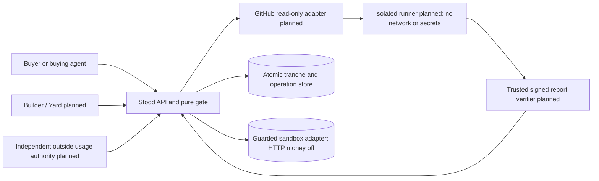
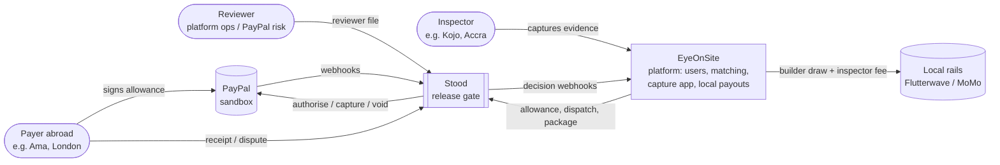
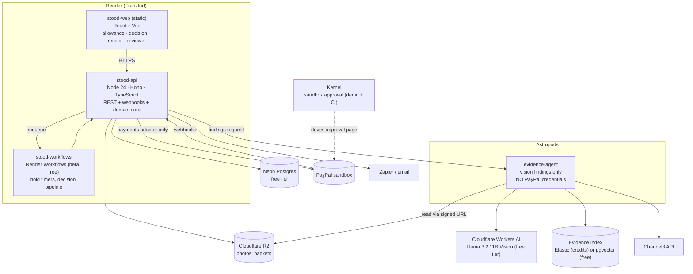
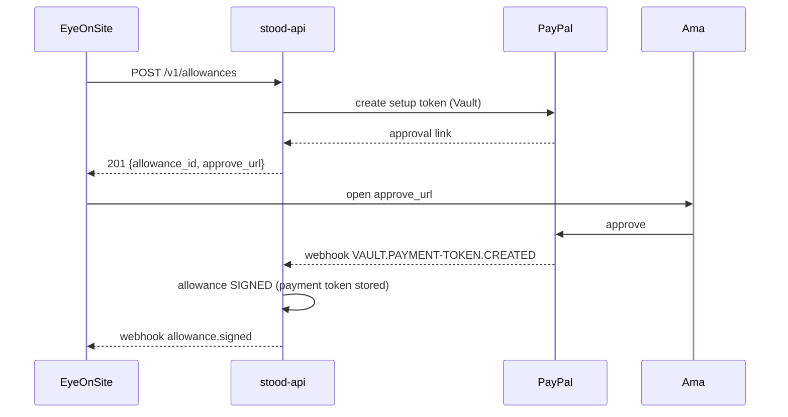
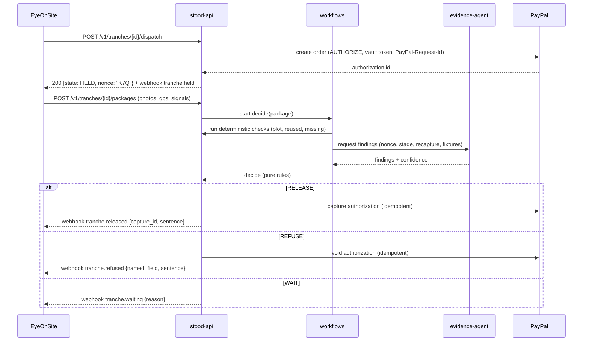

# T02: Architecture

## Code-milestone architecture (planned evidence services)



The fetch supervisor has narrowly scoped repository access; the execution sandbox has none. Pre-fetch allowed dependencies outside execution, verify digests and mount inputs read-only. Host-bound signing keys never enter the builder process. Limit CPU/memory/wall time/processes/disk/output; reject partial reports. A2A task negotiation and AP2 mandate exchange are planned caller surfaces, not payment authority. Yard belongs to a separate operator/repo.

Durable aggregate/ledger writes and reconciliation polling are implemented. Funding HTTP and trusted evidence ingestion remain planned. Stored ambiguous effects stay unresolved until exact provider proof; old-rule captures cannot be submitted.

## Scenario: site-visit architecture examples

The diagrams below illustrate EyeOnSite. Hosted services/screens/workflows are target designs unless explicitly recorded as implemented. The code-milestone flow above is the lead product.

Style: **hexagonal (ports and adapters) around a pure domain core**, with **runtime separation** between the code that looks at evidence and the code that moves money. Decisions: [ADR-0003](../adr/0003-rules-move-money.md), [ADR-0004](../adr/0004-authorise-on-dispatch-capture-on-proof.md).

## 1. System context (C4 level 1)



[EyeOnSite](https://github.com/ma-za-kpe/eyeonsite) is a scenario consumer. Integration details are in [T08](T08-eyeonsite-integration.md).

## 2. Containers (C4 level 2)



| Container | Responsibility | Holds secrets for |
|---|---|---|
| `stood-api` | HTTP API, domain core, payments adapter, webhooks in and out, receipt signing | PayPal (sandbox), DB, R2 (write), webhook HMAC, receipt signing key |
| `stood-workflows` | Durable steps and timers (dispatch → await package → checks → decide; reauthorise from day 4, day-27 warn, day-29 void). Calls back into the API's internal endpoints | Internal service token only |
| `stood-web` | Static SPA: Allowance, Decision, Receipt, Dispute packet, Reviewer file (AG Studio), Gantt (Bryntum) | None (public build) |
| `evidence-agent` | Returns **findings** (nonce text, stage class, recapture, fixtures match) with confidence. Never decides | Workers AI token, Channel3 key, index read key. **No PayPal** |

**Fallbacks:** if Render Workflows (beta) doesn't fit, timers run on **pg-boss** (MIT, Postgres-backed) inside `stood-api`, ticked by a scheduled GitHub Actions call. If Astropods credits run out, the evidence agent runs as a separate Render free web service with the same no-PayPal boundary.

## 3. Components inside `stood-api` (C4 level 3)

```text
src/
  domain/            ← pure. No I/O imports (enforced by dependency-cruiser)
    allowance/       Allowance aggregate, Stage, Geofence, Money
    tranche/         Tranche aggregate + state machine, Hold
    evidence/        Package, Photo, Finding, PhotoFingerprint, Nonce
    decision/        rules (pure functions), Decision, NamedField, RuleSetVersion
    records/         Receipt, DisputePacket (view models)
    events/          domain events
  application/       use cases (orchestrate domain + ports)
    createAllowance, confirmSignature, dispatchStage, submitPackage,
    decide, overrideDecision, openDispute, reconcile, tickHolds
  ports/             interfaces: PaymentGateway, EvidenceAgent, EvidenceIndex,
                     ProductCatalog, ObjectStore, Notifier, Clock, IdGen, EventBus
  adapters/
    payments-paypal/ ← the ONLY place that imports the PayPal Server SDK
    evidence-agent-http/, index-elastic/, index-pgvector/, catalog-channel3/,
    store-r2/, notify-zapier/, notify-email/, db-postgres/ (Drizzle)
  http/              Hono routes, auth, idempotency middleware, OpenAPI (zod-openapi)
```

**Import rules (CI-enforced):**

- `domain` → nothing outside `domain`.
- `application` → `domain`, `ports`.
- `adapters/*` → `ports`, `domain` types. Only `payments-paypal` may import `@paypal/*`.
- `evidence-agent` (a separate package) can't import `stood-api` payments code. It only shares the `contracts` package (JSON schemas).

## 4. Key sequences

### 4a. Sign the allowance



### 4b. Dispatch → package → refuse / release



## 5. Tranche state machine

```mermaid
stateDiagram-v2
  [*] --> PENDING: allowance signed
  PENDING --> HELD: dispatch → authorise ok
  PENDING --> WAIT_FUNDING: authorise declined
  WAIT_FUNDING --> HELD: retry ok
  HELD --> DECIDING: package complete
  DECIDING --> CAPTURE_PENDING: pass → reserve capture
  CAPTURE_PENDING --> RELEASED: capture confirmed
  DECIDING --> VOID_PENDING: hard failure → reserve void
  VOID_PENDING --> REFUSED: refusal void confirmed
  DECIDING --> WAITING: uncertain / system fault
  WAITING --> CAPTURE_PENDING: reviewer or payer release → reserve capture
  WAITING --> VOID_PENDING: reviewer refuse → reserve void
  HELD --> REAUTHORIZE_PENDING: day four → reserve renewal
  DECIDING --> REAUTHORIZE_PENDING: day four → reserve renewal
  WAITING --> REAUTHORIZE_PENDING: day four → reserve renewal
  REAUTHORIZE_PENDING --> HELD: confirmed / rejected; previously HELD
  REAUTHORIZE_PENDING --> DECIDING: confirmed / rejected; previously DECIDING
  REAUTHORIZE_PENDING --> WAITING: confirmed / rejected; previously WAITING
  REFUSED --> PENDING: re-dispatch allowed (≤ max re-submits)
  HELD --> VOID_PENDING: expiry → reserve void
  DECIDING --> VOID_PENDING: expiry → reserve void
  WAITING --> VOID_PENDING: expiry → reserve void
  VOID_PENDING --> EXPIRED: expiry void confirmed
  RELEASED --> DISPUTED: payer disputes
  RELEASED --> [*]
  EXPIRED --> [*]
```



The diagram shows construction's effects. `RELEASED` requires the profile's confirmed effect: CAPTURE for construction, VOID for a successful rental return ([ADR-0009](../adr/0009-assessment-and-payment-confirmation.md)). `REFUSED` and `EXPIRED` require a void id (or PayPal's own expiry confirmation). Pending operations block conflicting effects. A disputed capture keeps its reference.

Renewal is a separate operation, never a settlement. REAUTHORIZE_PENDING blocks capture, void and expiry until confirmed or definitely rejected; ambiguous failures retain the reservation. Its durable reservation and status reconciliation remain prerequisites for enabling the payment client (T-0132 / T-0056).

## 6. Cross-cutting

| Concern | Approach |
|---|---|
| Idempotency | `Idempotency-Key` header on all POSTs (stored 24h). Persist a provider UUID for each domain operation key, including hold attempt, action, renewal revision and definite-failure retry counter as applicable |
| Consistency | Persist the operation reservation and stable provider request ID transactionally before calling PayPal. Confirm the effect and append outbox events together afterward. Reconcile "PayPal succeeded, our write failed" without inventing a payment result |
| Concurrency | Optimistic locking (`version` column) plus one active effect per authorisation. Append immutable decisions; a later decision references the WAIT it supersedes. Atomic aggregate/ledger persistence is implemented |
| Time | An injected `Clock`. All times are UTC ISO-8601 |
| Config | 12-factor env vars, validated at boot with Zod. Missing payment keys disable payment routes without crashing |
| Versioning | URL `/v1`. Additive changes only within v1. Webhook payloads carry `schema_version` |
