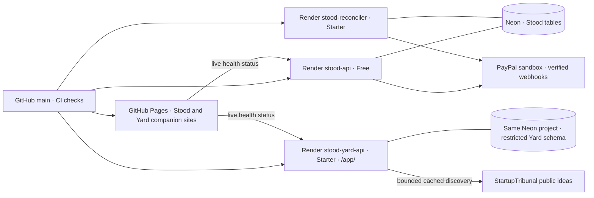

# T10: Deployment: where and how

## Code runner and builder hosting (planned)

Run tests on an isolated CPU/container host separate from the API; choose the actual sandbox technology with an ADR and prove no-network/no-secret/resource boundaries. Yard runs in its own operator/repo infrastructure, not in the payment API. GPU hosting such as Vast.ai is only a possible open-weight model option, not required for test execution or selected for this build. Compare measured workload, isolation, cold start and full cost before approving a provider or paid line item. No new cost estimate is asserted here.

The deployed services below are recorded in [SETUP](../SETUP.md). Signed runner ingestion, hosted Foreman, Yard-to-Stood payment adapters, previews and A2A/AP2 remain planned. Local development also uses SeaweedFS and Mailpit; they are not hosted service claims.

**Target cost: $0/month** on free tiers plus partner credits; as deployed, the owner chose Starter for both the reconciler worker and Yard web service (about $7/month each) ([NFR-07](T01-requirements.md#non-functional-requirements)). Region: **Frankfurt (EU Central)**, the closest Render region to both London (payers) and Accra / Lagos (inspectors and platform), and close to [EyeOnSite](https://github.com/ma-za-kpe/eyeonsite)'s `africa-south1` Firebase.

## Deployed topology

Yard's hosted Foreman and Stood payment adapter are still off; the diagram shows deployed connections only. [#76](https://github.com/ma-za-kpe/stood/issues/76) tracks the remaining live adapters.

## Environments

| Env | Where | Data | PayPal | Purpose |
|---|---|---|---|---|
| `local` | Docker Compose (Postgres, SeaweedFS for S3, Mailpit) | Fixtures only | Sandbox (dev app) or recorded | Development, TDD |
| `ci` | GitHub Actions + Testcontainers | Ephemeral | Recorded / replayed. Nightly live sandbox | Gates |
| `demo` | Render + Neon; public pages on GitHub Pages | Sandbox payments and operator-owned Board/private intake | Real PayPal sandbox | Hackathon judging. **The only hosted environment** |

There's no production environment during the hackathon. Going live would need a separate ADR (live PayPal app review, licensing, data protection).

## Services on Render (Blueprint `render.yaml`)

**As deployed (2026-10-08):** three Docker services in Frankfurt, automatically deploying checked `main` commits (`autoDeployTrigger: checksPass`). Stood migrations run in the reconciler's pre-deploy step; Yard migrations run in its own pre-deploy step. Failure stops that deployment. Neon uses direct TLS-verified URLs and a restricted Yard runtime role. Full settings and private-store locations are in [SETUP](../SETUP.md).

| Service | Plan | Image / command | Live entry point |
|---|---|---|---|
| `stood-api` | Free web service | Root `Dockerfile`, API server | [Health](https://stood-api.onrender.com/health), API `/v1` |
| `stood-reconciler` | Starter background worker | Root `Dockerfile`, `dist/reconcile-cli.js` | Status polling, signing/funding and hourly Transaction Search audit; no public page |
| `stood-yard-api` | Starter web service | `services/yard-api/Dockerfile`, includes built Yard web | [App](https://stood-yard-api.onrender.com/app/), [health](https://stood-yard-api.onrender.com/health) |
| Public pages | GitHub Pages | `site/` built and deployed by the Pages workflow | [Stood](https://ma-za-kpe.github.io/stood/), [Yard companion site](https://ma-za-kpe.github.io/stood/yard/) |

Infrastructure as code: `render.yaml` (a Blueprint) is committed. Every service and env var name is declared, with `sync: false` on secrets.

## Other service choices (targets unless noted)

| Service | Setup |
|---|---|
| **Neon** | One project `stood-demo` (eu-central-1). Branch `main`, plus an ephemeral branch per PR (optional). **Direct** (unpooled) connection string in Render env, because Stood uses `LISTEN` |
| **R2** | Bucket `stood-evidence` (private), lifecycle rule: delete `pkg/*` after 180 days. API token scoped to that bucket. Separate read-only token for the evidence agent |
| **Workers AI** | Account API token scoped to Workers AI only. Lives with the evidence agent, never in `stood-api` |
| **Astropods** | `evidence-agent/astropods.yml`, deployed with the Astro CLI from CI on release tags |
| **Elastic** | Serverless project (trial / credits), API key scoped to the `evidence-*` index. After the trial, switch `EVIDENCE_INDEX=pgvector` (data re-indexed by a script) |
| **Postman** | Workspace/monitors remain open on [#75](https://github.com/ma-za-kpe/stood/issues/75); no configured Postman key is claimed |
| **Kernel** | API key in `stood-api` (demo mode only) for `/demo/approve`, and in CI for E2E |

## Free-tier risks and mitigations

| Risk | Mitigation |
|---|---|
| Render web service sleeps after 15 min → the first judge request takes ~1 min | Existing GitHub Actions keep-warm job reads `/health` and `/ops/attention` every ten minutes. Public pages report unavailable health until the service answers; Postman remains pending |
| 750 free instance-hours per workspace (one always-warm service ≈ 744 h) | Only `stood-api` uses free web-service hours. Yard is Starter and includes its web app. Public companion sites are on GitHub Pages; evidence-agent hosting remains a target |
| PayPal webhooks hit a sleeping service | PayPal retries delivery. The Starter reconciler polls unresolved operations independently |
| Render free Postgres expires after 30 days | **We don't use it.** Neon free doesn't expire |
| Workers AI daily quota exhausted during judging | Rules-first pipeline (the model is skipped when a rule already refuses). A per-day budget guard. If exhausted, the decision is **WAIT**, never release. Optional paid model for judging days (ADR) |
| Elastic trial ends before 21 Dec | pgvector fallback adapter, a re-index script, and a config switch |
| Zapier free plan has no webhooks | Hackathon credits if offered. Otherwise the notifier uses the Zapier MCP actions or email (Resend free) |
| Partner trial watermarks (AG Studio / Bryntum) | Acceptable for the demo. Mention them in the README |

## Secrets and config

- Runtime secrets live in each Render service environment; private local values live in the gitignored root `.env` and `~/.config/stood/.env` (mode 600). Sandbox-nightly secrets live in GitHub Actions. Astropods is a future integration. See [HANDOFF](../HANDOFF.md).
- `.env.example` lists names only. Config is validated at boot with Zod, and **the API refuses to start if the PayPal base URL isn't sandbox** while `APP_ENV != live` (and `live` doesn't exist yet).
- Key rotation: PayPal app secret, HMAC secrets and the receipt signing key are rotated before the submission tag. Old ones are revoked.

## CI/CD pipeline

Required PR checks run repository hygiene, strict types, architecture boundaries, unit/contract/Postgres coverage gates, all cross-service scenarios and desktop/mobile browser checks for both public pages and hosted Yard. Release-please creates version/changelog PRs and tags releases. Render deploys `main` only after GitHub checks pass; GitHub Pages publishes the public pages from `main`. Nightly PayPal sandbox release/refusal and recording verification are active; the full cross-provider journey remains partial T-0234.

- **Rollback:** redeploy a previously qualified commit from Render's deploy history. Migrations are additive and forward-only; maintain compatibility with the running release.
- [Progress evidence and screenshots (#108)](https://github.com/ma-za-kpe/stood/issues/108) record the hosted C2 checks. Historical architecture choices above remain targets until qualified.

## Domains

Current URLs are <https://stood-api.onrender.com>, <https://stood-yard-api.onrender.com/app/> and <https://ma-za-kpe.github.io/stood/>. There is no deployed `stood-web.onrender.com` service. A custom domain remains optional; the existing Starter plans are already paid owner choices.
