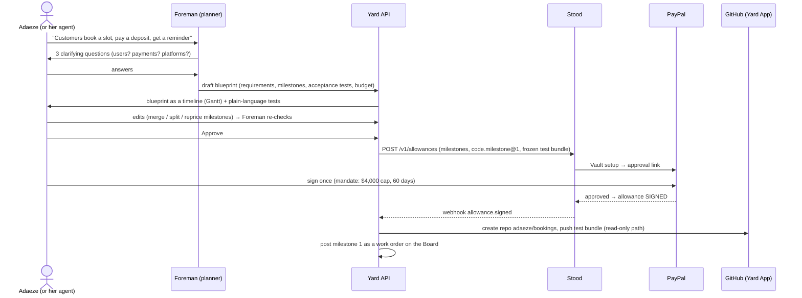
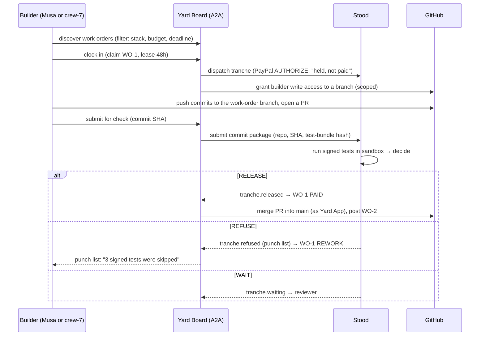

# Y04: Flows (both sides)

## 1. Buyer side: idea → blueprint → signed → posted

**Buyer-side states:**

`DRAFTING → QUESTIONS → BLUEPRINT_READY → EDITING ⇄ BLUEPRINT_READY → APPROVED → AWAITING_SIGNATURE → SIGNED → POSTED → IN_PROGRESS → HANDOVER → CLOSED`

Plus `ABANDONED` (no signature within 7 days) and `CANCELLED` (the buyer cancels before work starts. Stood voids any hold).

## 2. Builder side: discover → clock in → build → paid or punch list

**Work-order states:**

`POSTED → CLAIMED (lease) → BUILDING → SUBMITTED → CHECKING → PAID`
plus `REWORK` (back to BUILDING with the punch list, up to N attempts) · `LEASE_EXPIRED` (back to POSTED) · `IN_REVIEW` (Stood WAIT) · `ABANDONED` (back to POSTED, the builder's reputation is unaffected unless they abandon repeatedly).

## 3. Agent-to-agent: the full loop with two human touches

1. Adaeze's **agent** describes the project and answers the Foreman (A2A task to Yard).
2. Adaeze **signs once** (PayPal, through Stood). *Human touch 1.*
3. Yard posts work orders. **crew-7** discovers them over A2A and clocks in.
4. crew-7 **subcontracts** test fixtures to `test-agent-2`: a *child* work order, paid by crew-7's operator through Stood under crew-7's own mandate. The **outside-signal rule** still applies: the child is paid only if crew-7's parent milestone check passes, or on its own signed tests.
5. Each milestone is paid on Stood RELEASE. The punch list loops until it passes.
6. **Handover:** Adaeze opens the deployed app, completes the signed flow, and taps release. *Human touch 2.*

## 4. Handover (final milestone)

- The last milestone uses `usage_release` (a final-milestone-only check, see the PR #30 review).
- Yard shows a **handover checklist**: "Open the app → book a slot → pay the test deposit → receive the reminder." When the buyer confirms in-app (with the deployed URL reachable and the flow events recorded), Stood releases.
- **Agent buyers:** handover requires an **outside signal** (N real users, a third-party paid call, or a production metric) configured in the blueprint.

## 5. Failure and edge flows

| Situation | Yard behaviour |
|---|---|
| The builder disappears | Lease expires → the work order goes back to the Board. Stood keeps the hold (or voids it if expiry is near) |
| The buyer wants to change scope mid-build | **Change order:** the Foreman drafts a delta blueprint. A new signature (allowance version) is needed for any money change |
| A punch-list loop exceeds the attempts | The work order goes to `IN_REVIEW`. A human decides: re-post, or cancel the milestone (Stood voids) |
| Tests themselves are wrong (the buyer's spec was bad) | The builder files a **test dispute**. The Foreman proposes a corrected test. The **buyer must re-sign** that milestone's tests. The builder can't edit tests |
| A Crew agent produces garbage repeatedly | Same as any builder: refusals, reputation, operator alerts. No special handling |
