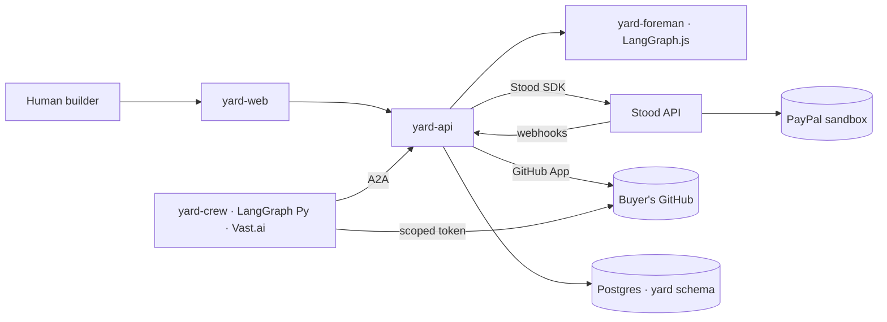

# Y11: Architecture and codebase

**One monorepo, two products.** Yard lives beside Stood in the same repo (shared tooling, CI, pre-commit, Docker, release process), but behind **hard boundaries**.

## Layout (planned)

```text
services/api/                 Stood (unchanged)
services/yard-api/            Yard: Board, blueprints, work orders, A2A surface, GitHub App
services/yard-foreman/        Foreman planner (LangGraph.js), no side-effect tools
services/yard-crew/           Crew builder agent (Python, LangGraph), LAST PHASE, Vast.ai
apps/yard-web/                Yard app (React + Vite): describe, blueprint, project room, Board
packages/contracts/           Shared types (already exists): Stood API types used by Yard
packages/stood-sdk/           Generated Stood SDK (APIMatic, from the OpenAPI spec)
site/                         Stood landing page
site/yard/                    Yard landing page (own CSS tokens, linked from Stood's nav)
docs/yard/                    These docs
```

## Boundaries (dependency-cruiser rules to add)

- `services/yard-*` and `apps/yard-web` **may not import** `services/api/**`. They talk to Stood only through `packages/stood-sdk` over HTTP. Yard must work against a hosted Stood exactly like EyeOnSite does.
- `services/yard-foreman` may not import the GitHub App, Stood SDK or payment code. It returns blueprints. The Yard API acts on them after buyer approval.
- `services/yard-crew` is a **separate deployable**. No database credentials for Yard's core. It talks to the Board over A2A / HTTP like any third-party builder.

## Runtime map



## Deployment (free / partner tiers first)

| Component | Where |
|---|---|
| `yard-api` | Render web service (Docker), the same region as Stood. Separate service, separate env group |
| `yard-foreman` | **Astropods** (partner), or a Render background service. Model on Workers AI (free) by default |
| `yard-web` + `site/yard/` | GitHub Pages (static) / Render static site |
| Database | The same Neon project, **separate schema and role** (`yard`). Yard's role has no grants on Stood tables |
| `yard-crew` | **Vast.ai** GPU instance(s) with vLLM, started per batch of work orders and torn down after (no idle GPUs) |
| Durable jobs | Render Workflows / pg-boss: lease expiry, posting next milestones, handover reminders |

## Same codebase, same discipline

The WoW applies unchanged:

- TDD, DDD
- GitFlow, ≥ 5-task rounds
- the pre-commit gate, DCO
- release-please

Yard gets its own **bounded contexts**: Blueprint, Board (work orders, claims, leases), Builders (identity, reputation) and Handover. Its ubiquitous language is the vocabulary in the [README](README.md).
