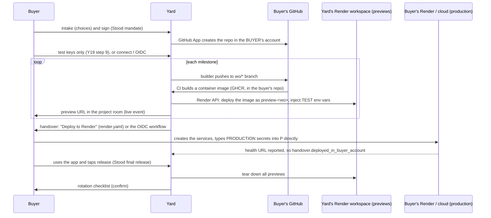

# Y20: Hosting and credentials decision

**Status:** proposed (2026-10-05). Needs an ADR when the engineer starts Round Y-C.

**Question:** a built product needs somewhere to run, and keys to reach its services. Who holds what, during the build and after it?

## 1. The options

### Option A: "Give us your keys, rotate them after"

The buyer gives Yard their real (production) keys at intake. Builders build and deploy straight into the buyer's own cloud. At the end, Yard tells the buyer to rotate every key.

### Option B: "We host it, then you migrate"

The engineering team spins up a sandbox (a Render service + database) and a GitHub repo **in Yard's accounts**. The product is built and hosted there. At handover, the buyer is asked to migrate the repo and hosting to their own accounts.

### Option C (hybrid): "Yours from the first commit, our previews, your production"

- **The repo** lives in the **buyer's GitHub** from day one. Yard reaches it only through its GitHub App, scoped to that repo.
- **During the build:** each milestone is deployed as a **preview** in **Yard's Render workspace**, with **test keys only**. Previews are short-lived and torn down automatically.
- **At handover:** production is created **in the buyer's own account** in one click:
  - a **"Deploy to Render"** button backed by the `render.yaml` Blueprint in their repo, or
  - a GitHub Actions workflow using **OIDC** for AWS / GCP / Azure.
- The buyer types production secrets **directly into their own hosting**. Yard never sees them.
- **Rotation** covers only the test keys Yard ever touched.

## 2. Comparison

| Criterion | A: their keys | B: we host, they migrate | C: hybrid |
|---|---|---|---|
| Production secrets ever held by Yard | **Yes**, all of them | **Yes**, the ones the app runs with | **Never** |
| Blast radius if Yard is breached | Every customer's production | Every hosted customer's production + data | Test keys + previews only |
| Relies on the buyer rotating keys | **Entirely** (most people won't) | Partly | Only for test keys, and those auto-expire |
| Who owns the code | Buyer | **Yard**, until transfer | Buyer, from commit 1 |
| Migration risk at the end | None | **High**: repo transfer, database export / import, DNS, env vars, downtime. "Temporary" hosting tends to become permanent | Low: production is created fresh from `render.yaml`. Data is new at launch |
| Yard's legal role | Processor with production access | **Host of record**: data controller / processor duties, uptime, abuse, takedowns | Preview host for test data only |
| Cost to Yard | Low | **Ongoing** hosting + database for every finished project | Bounded: previews have a TTL |
| Buyer effort | Gather and paste many keys up front (high) | Lowest during the build, highest at migration | Low: connect GitHub, a few test keys, one deploy click at the end |
| Fits Stood's final release | Yes | **Weak**: the "product in use" signal comes from Yard's own hosting | **Strong**: usage evidence comes from the buyer's own deployment |
| Builders / agents near secrets | Yes, unless we build heavy isolation | Yes | No. Builders use emulators and fakes |
| Hackathon feasibility | Easy to fake, dangerous to normalise | Medium | **High**: Render API + `render.yaml` + GitHub App are all standard |

## 3. Decision (recommended): **Option C**

1. **It removes the worst failure.** The only way to never leak a production key is to never hold one. Rotation advice (option A) is a safety net, and most users won't use it.
2. **Ownership is clear from the first commit.** The repo Stood checks is the buyer's repo. Stood's signed reports bind to *that* repository. No transfer step can break the binding or cause a dispute.
3. **It gives the strongest handover evidence.** The final milestone (`code.final@1`, usage release) passes when the buyer uses the app **deployed in their own account**. Yard records `handover.deployed_in_buyer_account` by checking the health URL the buyer's deploy reports.
4. **It's cheap and bounded for Yard.** Previews expire. We are never a long-term host by accident.
5. **It's buildable now.**
   - Render's Blueprint spec (`render.yaml`) supports a **Deploy to Render** button.
   - Environment variables marked `sync: false` are **prompted for in the buyer's own Render dashboard** at creation time. That's exactly how production secrets should arrive.

### What we keep from options A and B

- **From B:** the preview sandbox. The buyer sees a working URL for every milestone without owning any infrastructure yet.
- **From A:** the **rotation checklist**. It's always shown at handover, and the buyer must confirm it (`handover.rotation_confirmed`) before the project closes. With option C, the list is short.
- **"Keep it hosted with Yard"** is **not offered**. If a buyer doesn't want to run hosting, the handover milestone uses the Render one-click path, which is the lowest-effort option that still leaves them the owner. Managed hosting could become a later, separate product with its own terms. It isn't part of Yard v1.

## 4. How option C works, step by step

### Previews (Yard's Render workspace)

- **Built from an image, not from the repo.** CI in the buyer's repo builds and pushes a container image. Yard deploys that image through the Render API. Render never needs access to the buyer's repo, and the preview runs exactly what Stood checked.
- **Test env only.** The preview gets the TEST / DEV secrets from Y19 and a preview database (a fresh Render Postgres or the buyer's **dev** Supabase / Firebase project). No production data, ever.
- **TTL.** A preview lives until its milestone is paid + 7 days, with a hard cap of 30 days. Previews sleep when idle, and all of them are deleted at handover.
- **Cost** is an explicit line item in the blueprint ("Preview hosting, about $X"), never hidden ([Y13](Y13-security-trust-and-economics.md)).
- **Labelled.** Every preview shows a "Preview, test data, built by Yard" banner. It isn't a place to launch.
- **Render free-tier note:** free instances spin down when idle, and free Postgres databases expire after a fixed period. Previews can use free instances. Production must not. Check Render's current terms before relying on either.

### Production (the buyer's account)

| Buyer's choice in Y19 step 8 | Handover milestone delivers |
|---|---|
| **My own Render** (default) | `render.yaml` in the repo + a **Deploy to Render** button. Secrets are `sync: false`, so Render asks the buyer for each one. A `HANDOVER.md` lists every variable, where to get it, and its test-vs-live difference |
| **My AWS / GCP / Azure** | A GitHub Actions deploy workflow in the buyer's repo using **OIDC** (no stored cloud keys) + IaC (Terraform or the provider's native tool), plus `HANDOVER.md`. The buyer runs the one-time trust setup from a script in the repo, in their own console |
| **Decide later** | The Render path is prepared. The final milestone can't be released until it's deployed *somewhere* the buyer owns, because the usage signal needs it |

## 5. The handover rotation checklist (always shown)

Shown on the Handover screen ([Y10](Y10-screens-and-site.md) #6). Each item has a link and a checkbox. Items Yard can do itself are done and shown as done.

| # | Item | Who |
|---|---|---|
| 1 | Production secrets were entered directly in your hosting (not sent to Yard) | Buyer confirms |
| 2 | Rotate or delete each **test key** you gave Yard (listed by provider, with links to the provider's key page) | Buyer |
| 3 | Yard has deleted its stored copies of your keys (auto, 7 days after handover. "Delete now" button) | Yard |
| 4 | All preview services and preview databases deleted | Yard (auto) |
| 5 | Builder access removed from the repo (wo/* branches merged or closed) | Yard (auto) |
| 6 | Keep or uninstall the Yard GitHub App (keep it if you'll post more work orders) | Buyer |
| 7 | Remove any OIDC trust / IAM role that was only for previews (dev account) | Buyer (script provided) |
| 8 | Turn on MFA and billing alerts on your hosting and cloud accounts | Buyer |
| 9 | If a test key was ever pasted somewhere unexpected (chat, an issue), rotate it now | Buyer |

The project moves to `CLOSED` only after the buyer confirms (`handover.rotation_confirmed`). Stood's final release doesn't wait for this. Money and hygiene are separate.

## 6. Phasing

| Phase | What ships |
|---|---|
| **Hackathon demo (Y0–Y3a)** | Repo in a demo buyer's GitHub. Previews in Yard's Render with **fixture** test keys. A Deploy to Render button on the reference app. The rotation checklist UI with fixture items |
| Y2 | Real previews from images via the Render API, TTL job (Render Workflows / pg-boss), secret store with KMS |
| Y3 | OIDC handover workflows for AWS and GCP, `HANDOVER.md` generator, health-URL check |
| Later | Supabase / Firebase "connect" flows instead of pasted dev keys |

## 7. Open questions

- Which KMS (Render has no native KMS: use AWS KMS or GCP KMS with a tightly scoped key, or libsodium sealed boxes with the key in a Render secret file for the demo)?
- Preview databases: a fresh Render Postgres per blueprint, or always the buyer's dev Supabase / Firebase project?
- Do we allow preview URLs on a Yard subdomain (`*.preview.yard…`) or Render's default `onrender.com` URLs? (Default URLs for v1.)
